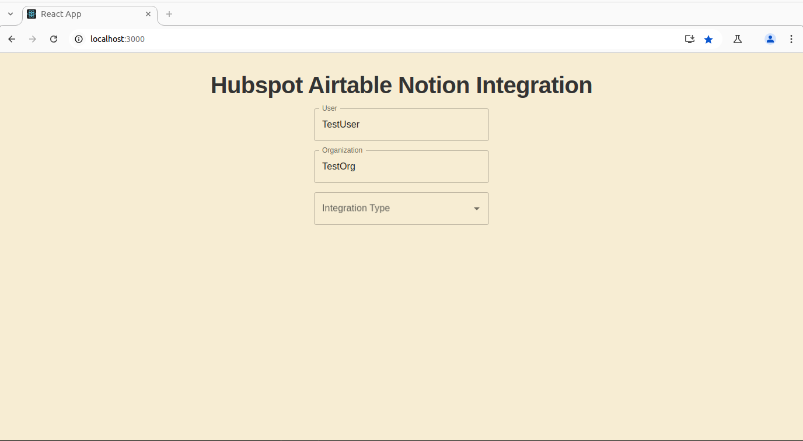
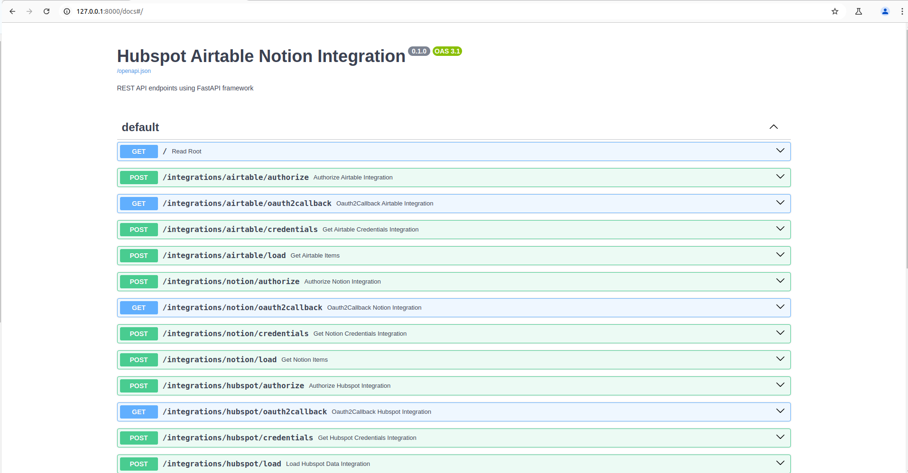

# HubSpot Integration - FastAPI Project

## Overview
This project integrates **HubSpot** with a FastAPI backend and a React frontend, enabling OAuth authentication and fetching HubSpot contacts and company details. It supports Redis caching for improved performance.

#### What is OAuth 2.0?
OAuth 2.0 is an industry-standard protocol for authorization, allowing secure access to user data without exposing credentials. It enables applications to request **scoped** access to a user's data through a secure **token-based** authentication system.

#### **Different Methods of Authentication Security**
1. **Basic Authentication** - Uses a username and password for authentication. Less secure if not encrypted.
2. **OAuth 2.0** - A token-based system that allows apps to access resources without exposing credentials.
3. **API Keys** - Static keys that grant access to APIs but lack fine-grained control.
4. **JWT (JSON Web Token)** - A stateless and secure way to handle authentication between clients and servers.

OAuth 2.0 is one of the most secure methods and is widely used for third-party integrations, including HubSpot.


## Features
- OAuth 2.0 authentication with HubSpot.
- Store access tokens securely in Redis.
- Modular backend in FastAPI and frontend in React.
- Fetch and display HubSpot Metadata : contacts and company details in json format.
- Logging
- Error handling

## Tech Stack
### **Backend**
- **FastAPI** (Python)
- **Redis** (Caching tokens & session data)
- **HTTPX & Requests** (API calls)
- **Pydantic** (Data validation)
- **Logging** (Debugging & monitoring)

### **Frontend**
- **React (JavaScript)**
- **Axios** (API requests)

## Approach
1. **OAuth Authentication**:
   - User initiates authorization via `/integrations/hubspot/authorize`.
   - Redirects to HubSpot’s OAuth page.
   - On callback, exchanges authorization code for an access token.
   
2. **Data Retrieval**:
   - Fetches contacts and account metadata using the access token.
   - Combines and structures the data.
   
3. **Caching**:
   - Stores tokens and session details in Redis.
   - Uses `redis-cli KEYS "*"` to check cached parameters.

## Developer Setup
### **Prerequisites**
- Python 3.13
- Node.js v20.16.0
- Redis 7.4.2
- HubSpot Developer Account, Hubspot Test account

### **Steps to Run**
1. **Extract ZIP file**.
2. **Backend Setup**:
   ```bash
   cd backend
   #activate venv environment
   pip install -r requirements.txt
   uvicorn main:app --reload
   ```
3. **Frontend Setup**:
   ```bash
   cd frontend
   npm install
   npm start
   ```
4. **Start Redis**:
    For more details on Redis, refer my blog post : [Redis Simple Guide](https://nazneenprojects.github.io/techcrafting-with-keying/2025/02/25/Redis-Guide.html)
   ```bash
   redis-server
   ```
5. **Check Redis Cached Parameters**:
   ```bash
   redis-cli KEYS "*"
   ```

## Running Tests
```bash
pytest tests/unit/
OR
cd tests/unit/
pytest test_hubspot.py -v
```

## API Endpoints (HubSpot Integration)
- **Authorize HubSpot**: `/integrations/hubspot/authorize`
- **OAuth Callback**: `/integrations/hubspot/oauth2callback`
- **Get Credentials**: `/integrations/hubspot/credentials`
- **Load HubSpot Data**: `/integrations/hubspot/load`

## Output samples collected
### Auth URL:
AUTHORIZATION_URL="https://app-na2.hubspot.com/oauth/authorize?client_id=<XXXXXXX>&redirect_uri=http://localhost:8000/integrations/hubspot/oauth2callback&scope=oauth%20crm.objects.contacts.read&optional_scope=crm.objects.companies.read"

###
Credential API
http://localhost:8000/integrations/hubspot/credentials
Response :
{
    "token_type": "bearer",
    "refresh_token": "<XXXXXXX>,
    "access_token": "<XXXXXXX>",
    "expires_in": 1800
}

### Load items of Hubspot
http://localhost:8000/integrations/hubspot/load
Response :
"{\"items\": [{\"id\": \"90023910123\", \"type\": null, \"directory\": false, \"parent_path_or_name\": null, 
\"parent_id\": null, \"name\": \"Maria Johnson (Sample Contact)\", \"creation_time\": \"2025-02-27T11:06:32.364Z\", 
\"last_modified_time\": \"2025-02-27T11:06:53.278Z\", \"url\": null, \"children\": null, \"mime_type\": null, 
\"delta\": null, \"drive_id\": null, \"visibility\": true, \"email\": \"emailmaria@hubspot.com\", \"portal_id\": 242115267, 
\"time_zone\": null, \"company_currency\": \"USD\", \"additional_currencies\": null, \"utc_offset\": null, \"ui_domain\": 
\"app-na2.hubspot.com\", \"data_hosting_location\": null}, {\"id\": \"90038928091\", \"type\": null, \"directory\": false, 
\"parent_path_or_name\": null, \"parent_id\": null, \"name\": \"Brian Halligan (Sample Contact)\", \"creation_time\": 
\"2025-02-27T11:06:32.669Z\", \"last_modified_time\": \"2025-02-27T11:06:53.278Z\", \"url\": null, \"children\": null, 
\"mime_type\": null, \"delta\": null, \"drive_id\": null, \"visibility\": true, \"email\": \"bh@hubspot.com\", \"portal_id\":
242115267, \"time_zone\": null, \"company_currency\": \"USD\", \"additional_currencies\": null, \"utc_offset\": null, \"ui_domain\": 
\"app-na2.hubspot.com\", \"data_hosting_location\": null}, {\"id\": \"90251692785\", \"type\": null, \"directory\": false, 
\"parent_path_or_name\": null, \"parent_id\": null, \"name\": \"Nazneen Mulani\", \"creation_time\": \"2025-02-28T08:26:11.589Z\", 
\"last_modified_time\": \"2025-02-28T08:31:13.109Z\", \"url\": null, \"children\": null, \"mime_type\": null, \"delta\": null, 
\"drive_id\": null, \"visibility\": true, \"email\": \"mulanisnaaz@gmail.com\", \"portal_id\": 242115267, \"time_zone\": null, 
\"company_currency\": \"USD\", \"additional_currencies\": null, \"utc_offset\": null, \"ui_domain\": \"app-na2.hubspot.com\", 
\"data_hosting_location\": null}]}"


### Redis
REDIS values
1) "hubspot_state:TestOrg:TestUser"
2) "hubspot_verifier:TestOrg:TestUser"
3)  "hubspot_credentials:TestOrg:TestUser"

## Official HubSpot Docs Reference
- [HubSpot API Key](https://app-na2.hubspot.com/developer-api-key/242106441)
- [OAuth Authentication](https://developers.hubspot.com/docs/reference/api/app-management/oauth)
- [Contacts API](https://api.hubapi.com/crm/v3/objects/contacts)
- [Companies API](https://developers.hubspot.com/docs/reference/api/crm/objects/companies)

## Future Scope
- UI Enhancements to display retrieved HubSpot data.
- Addition of remaining unit test cases
- Poetry support for production level project for better dependency management
- Improve Redis session management.
- Implement background tasks for refreshing tokens.
- Docker file support
- Github workflow with CICD pipeline 
- Render hosting

## Deployment
- **NA**

## Snaps from localhost working setup



